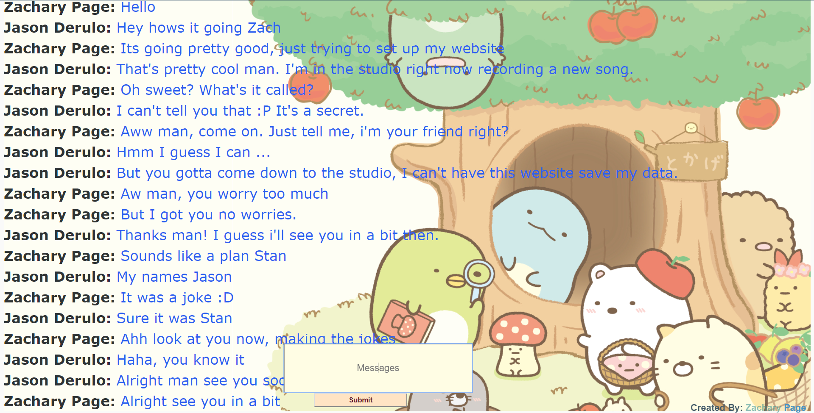

# Chat Program

## Table of Contents

- [Features](#features)
- [Examples](#examples)
- [Support](#support)

## Features

- Allows multiple clients to connect to the server and chat away using names of their own choosing.

## Examples 
**Example of two clients**

## Support

Reach out to me at one of the following places!

- LinkedIn at <a href="https://www.linkedin.com/in/pagezacharyc/" target="_blank">Zachary Page</a>
- Email at <a href='mailto:pagezacharyc@gmail.com' target="_blank">pagezacharyc@gmail</a>

---
